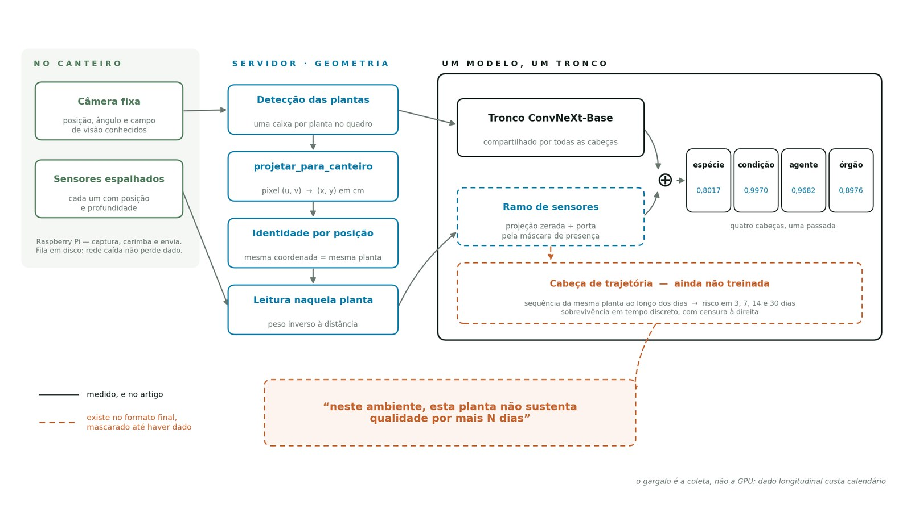
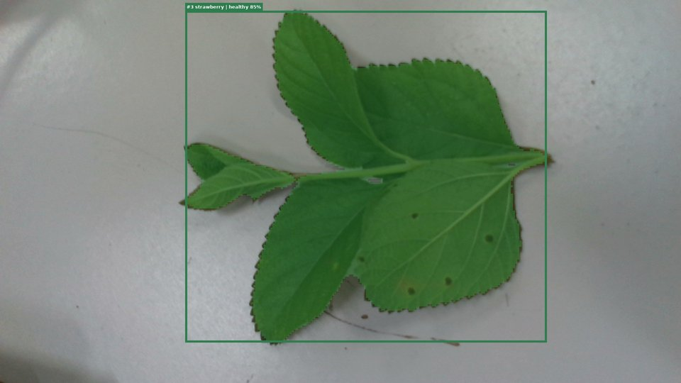
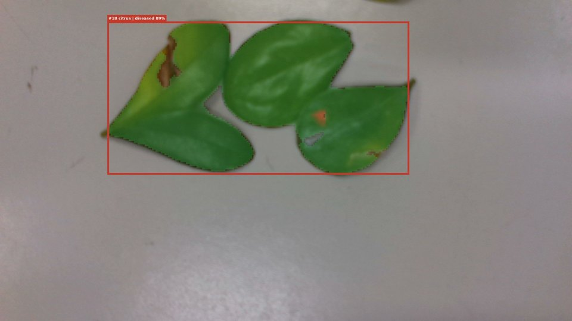
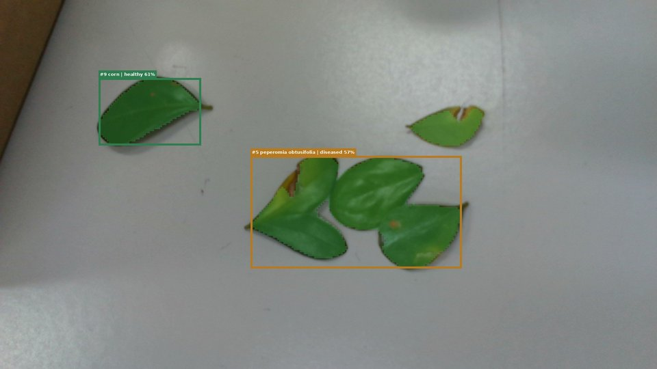
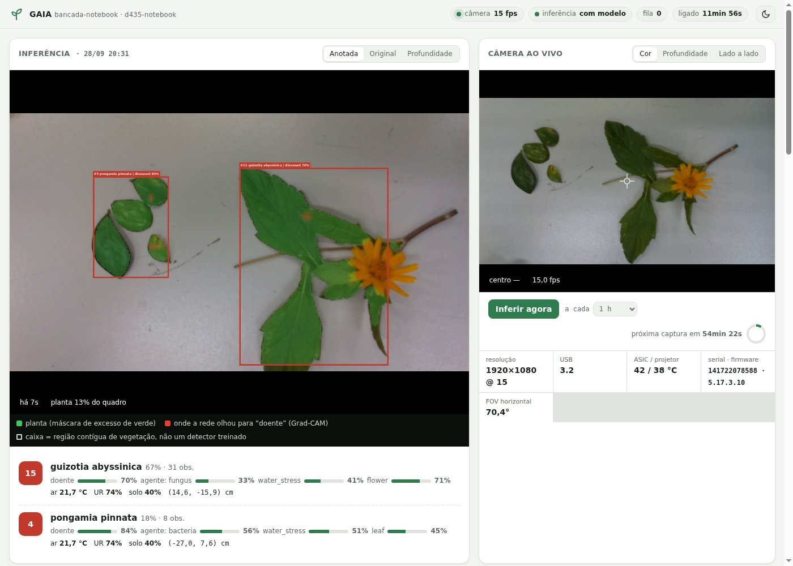
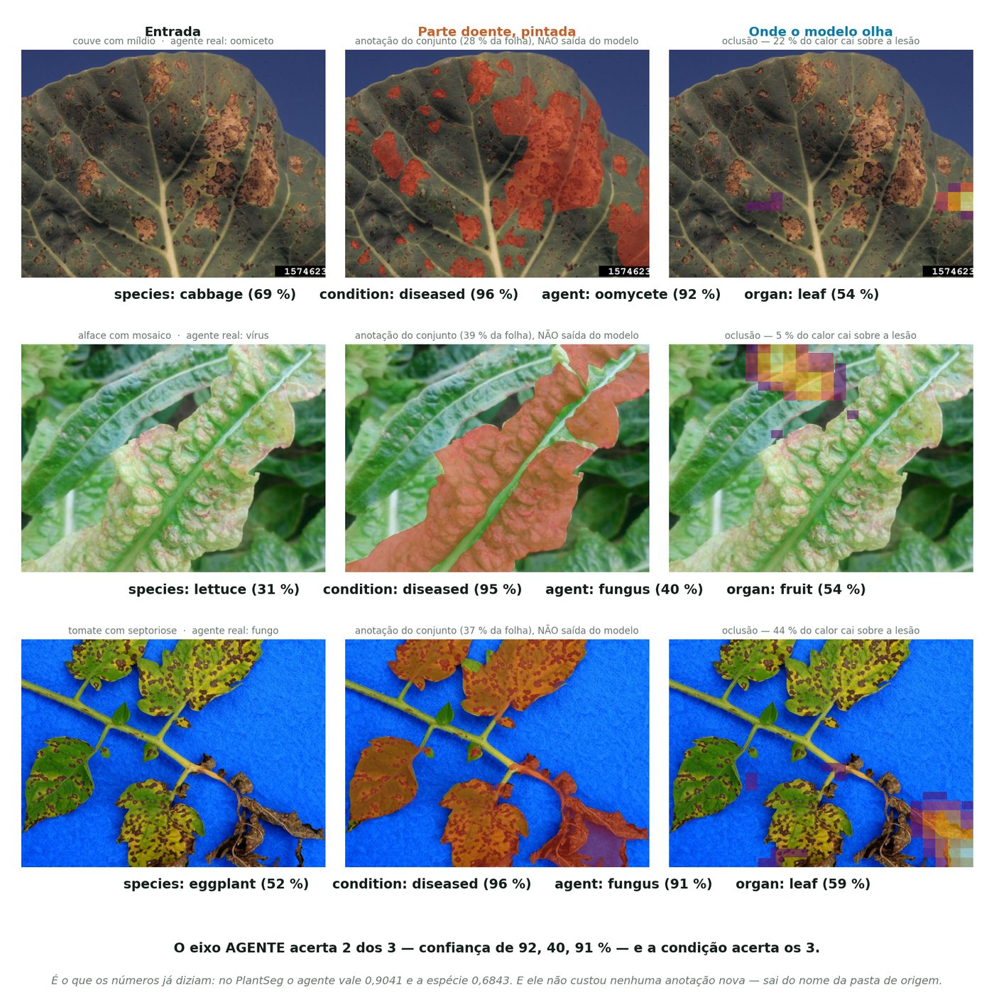
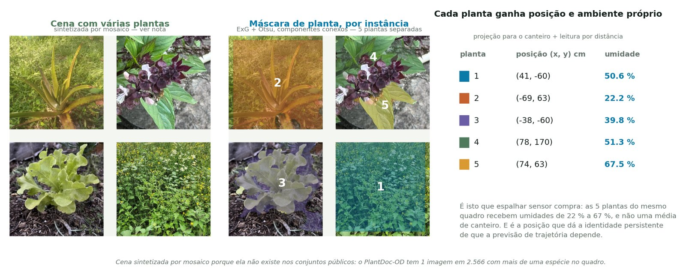
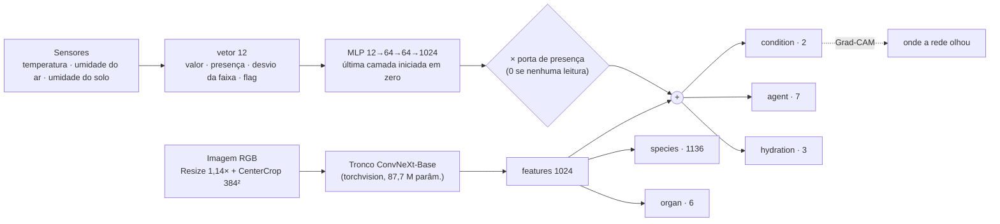

# GAIA — monitoramento de plantas com câmera, sensores e IA

Protótipo embarcado de fenotipagem. Um **nó de captura** (Raspberry Pi 3 + Intel
RealSense D435 + sensores) fotografa o canteiro em intervalos. Um **servidor de
inferência** (PC/notebook com GPU) encontra as plantas na imagem, reconhece cada uma
pela posição ao longo do tempo e classifica espécie, condição (saudável/doente),
agente, hidratação e órgão, usando também as leituras de temperatura e umidade.

<p align="center">
  
</p>

Este repositório tem **só código e documentação**. O modelo pré-treinado é
publicado à parte, no Hugging Face. O código de treino e os dados acompanham o
artigo e não estão aqui.

## Em funcionamento

Capturas reais da bancada, feitas com a D435 e anotadas pelo servidor. As caixas
são as plantas encontradas; a cor diz a condição (verde saudável, âmbar incerto,
vermelho doente); o vermelho translúcido é onde a rede olhou para decidir "doente".

| saudável | doente | cena mista |
|---|---|---|
|  |  |  |
| condição *healthy* 85 % | condição *diseased* 89 %, agente *bacteria* | *healthy* 61 % e *diseased* 57 % |

A interface do nó, com a inferência como painel principal e a câmera ao vivo ao lado:



Resultados qualitativos do modelo: a parte doente pintada e a cena com várias plantas,
cada uma com posição e ambiente próprios.




## A rede

Um modelo só, com um tronco compartilhado e uma cabeça por pergunta. Os sensores
entram por um ramo à parte, somado às features da imagem **só nas cabeças em que o
ambiente importa**.



- **Espécie e órgão** dependem só da aparência: usam as features puras da imagem.
- **Condição, agente e hidratação** usam imagem + sensores.
- O ramo de sensores nasce **neutro**: a projeção final começa em zero e a porta
  zera a contribuição quando não há leitura. O modelo é idêntico ao só-imagem até
  existir dado de sensor que ensine alguma coisa.
- Sensor ausente é ausente (flag 0), nunca zero.

Detalhes em [documentos/06-modelo.md](documentos/06-modelo.md).

## Etapa atual

**Modelo**
- [x] Classificação multi-cabeça treinada: espécie (1136), condição, agente, órgão
- [x] Tronco ConvNeXt-Base a 384 px, com aumento de dados contra borrão, baixa resolução e ruído
- [x] Ramo de sensores na arquitetura (neutro até haver dado)
- [x] Explicação visual por Grad-CAM na cabeça de condição
- [ ] Cabeça de hidratação com rótulo (existe, ainda sem dado)
- [ ] Ramo de sensores treinado com leituras reais da horta
- [ ] Cabeça de trajetória: "esta planta não sustenta qualidade por mais N dias"
- [ ] Detector de plantas treinado (hoje: máscara de vegetação)
- [ ] Modelo público no Hugging Face (privado até o artigo)

**Sistema**
- [x] Servidor de inferência com identidade da planta por posição e sensores por distância
- [x] Nó de captura com RealSense D435 (cor + profundidade alinhada), fila em disco e interface web
- [x] Sensores plugáveis (DHT11/22, DS18B20, MCP3008, comando, simulado)
- [x] Inferência contínua na bancada, com câmera real a cada 10 s
- [x] Imagem do SD do Raspberry Pi com instalação 100 % offline (validada em ARM64 emulado)
- [ ] Validação do nó no Raspberry Pi 3 físico, no canteiro
- [ ] Coleta longitudinal na horta
- [ ] Artigo

## Começo rápido (tudo num PC, com a câmera no USB)

```bash
pip install -r requirements.txt pyrealsense2
python3 servidor/baixar_modelo.py            # modelo -> modelo/
cd servidor && ./iniciar.sh                  # servidor em :8077
# outro terminal:
cd estacao && python3 estacao.py --config estacao-notebook.json
```

Abra **http://localhost:8080**. Sem câmera, use `--simular`, que gera cena e
sensores sintéticos.

## Organização

| pasta | o que é |
|---|---|
| `gaia/` | pacote de inferência: arquitetura, preditor, sensores, geometria, máscara, Grad-CAM, anotação |
| `servidor/` | API FastAPI + SQLite: recebe capturas, infere, guarda séries por planta |
| `estacao/` | nó de captura: RealSense, sensores plugáveis, fila offline, interface web |
| `estacao/imagem/` | gera o cartão SD do Raspberry Pi, com instalação 100 % offline |
| `estacao/qemu/` | VM ARM64 que imita o Pi 3 para testar sem hardware |
| `ferramentas/` | exporta um checkpoint para publicar no Hugging Face |
| `documentos/` | como tudo funciona e como montar outros protótipos |
| `modelo/` | vazia; recebe o modelo baixado |

## Documentação

1. [Visão geral e arquitetura](documentos/01-visao-geral.md)
2. [Servidor e inferência](documentos/02-servidor-e-inferencia.md), incluindo a API
3. [Estação de captura e interface web](documentos/03-estacao.md)
4. [Raspberry Pi: imagem do SD, rede, ligação do DHT11](documentos/04-raspberry.md)
5. [Criando outros protótipos](documentos/05-novos-prototipos.md)
6. [O modelo: entradas, saídas, limites e publicação](documentos/06-modelo.md)

## Referências

**Modelo e métodos**
- Z. Liu, H. Mao, C.-Y. Wu, C. Feichtenhofer, T. Darrell, S. Xie. *A ConvNet for the 2020s.* CVPR, 2022.
- R. R. Selvaraju, M. Cogswell, A. Das, R. Vedantam, D. Parikh, D. Batra. *Grad-CAM: Visual Explanations from Deep Networks via Gradient-based Localization.* ICCV, 2017.
- D. M. Woebbecke, G. E. Meyer, K. Von Bargen, D. A. Mortensen. *Color indices for weed identification under various soil, residue, and lighting conditions.* Transactions of the ASAE, 38(1), 1995.
- N. Otsu. *A threshold selection method from gray-level histograms.* IEEE Transactions on Systems, Man, and Cybernetics, 9(1), 1979.

**Conjuntos de dados usados no treino** (não distribuídos aqui)
- D. P. Hughes, M. Salathé. *An open access repository of images on plant health to enable the development of mobile disease diagnostics.* arXiv:1511.08060, 2015. (PlantVillage)
- D. Singh, N. Jain, P. Jain, P. Kayal, S. Kumawat, N. Batra. *PlantDoc: A Dataset for Visual Plant Disease Detection.* CoDS-COMAD, 2020.
- C. Garcin et al. *Pl@ntNet-300K: a plant image dataset with high label ambiguity and a long-tailed distribution.* NeurIPS Datasets and Benchmarks, 2021.
- T. Wei et al. *PlantSeg: A Large-Scale In-the-wild Dataset for Plant Disease Segmentation.* arXiv:2409.04038, 2024.
- GBIF.org — Global Biodiversity Information Facility, ocorrências com imagem.

**Hardware e software**
- Intel RealSense D400 Series Product Family Datasheet; librealsense / pyrealsense2.
- PyTorch e torchvision; FastAPI; SQLAlchemy; Raspberry Pi OS.

**Este projeto**
- GAIA — artigo em preparação. A citação entra aqui quando publicado.
